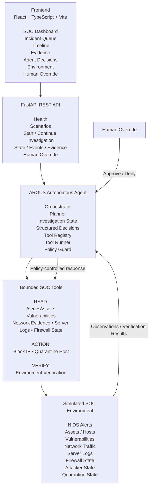
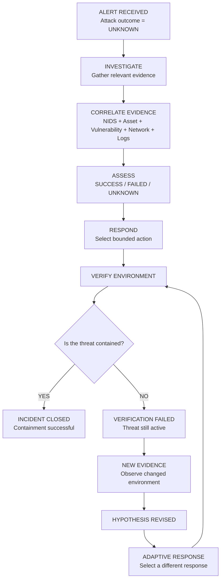
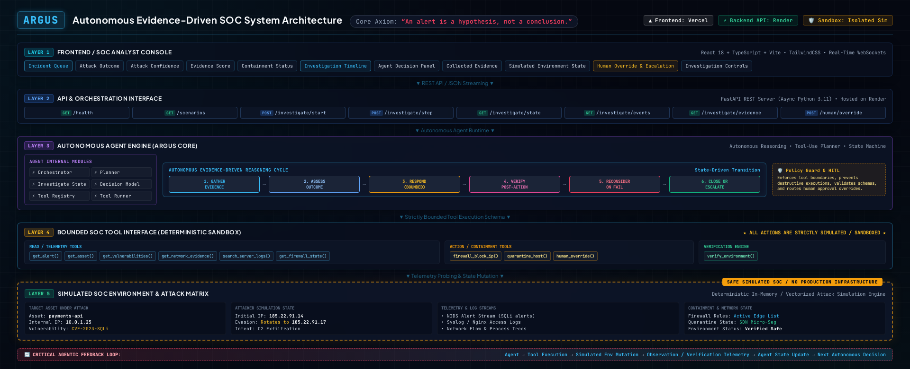
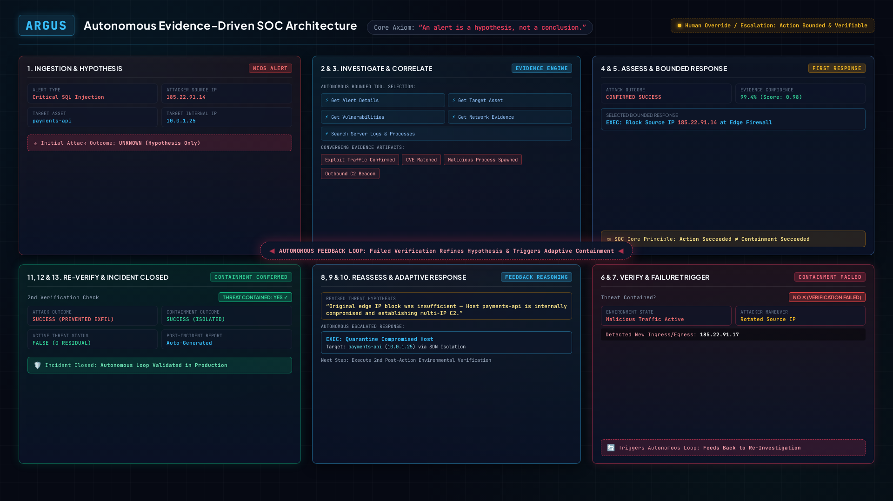

# ARGUS — Autonomous Evidence-Driven SOC

> **An alert is a hypothesis, not a conclusion.**

## Project Overview

ARGUS is an autonomous, evidence-driven Security Operations Center (SOC) designed to investigate security alerts, determine whether an attack actually succeeded, take a bounded response, verify whether that response worked, and adapt when it did not.

Traditional alert handling often follows a simple pattern:

**Alert → Rule → Action**

That approach has a major weakness: an alert is not proof of a successful compromise, and a response action being executed successfully does not mean that the threat has actually been contained.

ARGUS approaches the problem as a continuous investigation loop:

**ALERT → INVESTIGATE → CORRELATE → ASSESS → ACT → VERIFY → ADAPT**

The agent starts with an unknown attack outcome, gathers evidence from multiple sources, makes a decision based on the current investigation state, interacts with a simulated SOC environment through bounded tools, and then observes the result. If verification shows that the threat is still active, ARGUS gathers new evidence, revises its working hypothesis, and selects a different response.

The entire SOC environment is simulated and sandboxed. No real firewall, production system, credentials, or live attack infrastructure is used.

---

# Quick Links

### GitHub Repository

**https://github.com/Soyam-Patra/argus-autonomous-soc**

### Live Web Application

**https://argus-autonomous-soc.vercel.app**

### Demo Video

**[YouTube Demo](https://youtu.be/QPbxsV44LtI?si=WN2FqfwetzzCjkQR)**

> The video demonstrates the primary adaptive intrusion scenario step-by-step, including evidence collection, attack assessment, first response, failed verification, hypothesis revision, adaptive response, and successful containment.

---

# What Problem Does ARGUS Solve?

A SOC receives a large number of alerts from security monitoring systems. The difficult part is not simply detecting suspicious activity; it is determining:

- Is this a real attack or a false positive?
- Did the attack actually succeed?
- What evidence supports that conclusion?
- What response is appropriate?
- Did the response actually contain the threat?
- What should happen if the first response fails?

A conventional automation workflow may block an IP after an alert and stop there.

ARGUS does not.

It treats the alert as a **hypothesis** and continuously checks whether the available evidence supports that hypothesis.

For example:

> A NIDS detects a SQL injection attempt against a payments API.

ARGUS does not immediately conclude:

> "SQL injection detected → attacker compromised the server."

Instead, it investigates the target, checks vulnerabilities, examines network activity, searches server logs, correlates the evidence, and then determines whether the attack was actually successful.

If it decides that a response is necessary, it acts and then verifies the environment again.

---

# Primary Demonstration Scenario

The main demonstration uses a simulated SQL injection incident:

| Field | Value |
|---|---|
| Alert | ALERT-003 |
| Target service | payments-api |
| Target IP | 10.0.1.25 |
| Initial attacker IP | 185.22.91.14 |
| Attack type | SQL Injection |
| Initial outcome | Unknown |
| Final attack outcome | Success |
| First response | Block source IP |
| Verification | Failed |
| New attacker IP | 185.22.91.17 |
| Adaptive response | Host quarantine |
| Final containment | Success |
| Final active threat | False |

The important part of this scenario is that the first response **does not fully contain the attacker**.

The attacker changes source IPs. ARGUS detects that its first containment strategy was ineffective, gathers additional evidence, revises its working hypothesis, and changes the response from IP blocking to host-level quarantine.

---

# System Architecture

The system is divided into five main layers.



### Deployment

```text
┌──────────────────────────────┐
│         Vercel               │
│                              │
│ React + TypeScript + Vite    │
│        ARGUS Dashboard       │
└──────────────┬───────────────┘
               │ HTTPS / REST API
               ▼
┌──────────────────────────────┐
│          Render              │
│                              │
│       FastAPI Backend        │
│             ↓                │
│     ARGUS Agent              │
│             ↓                │
│   Simulated SOC Environment  │
└──────────────────────────────┘
```

---

# Agentic Workflow

ARGUS is designed around a feedback-driven investigation loop rather than a fixed sequence.



The key feedback loop is:

**Agent → Tool → Environment → Observation → Agent State Update → Next Decision**

This is what allows ARGUS to respond to failure rather than simply following a predefined list of actions.

---

# How the Main Investigation Works

## 1. Alert Received

ARGUS starts with a NIDS alert.

At this point:

**Attack outcome = UNKNOWN**

The agent does not automatically treat the alert as a confirmed compromise.

The initial decision is to gather evidence.

---

## 2. Investigate the Target

ARGUS retrieves information about the target asset.

For the primary scenario:

**payments-api — 10.0.1.25**

The agent uses this information to understand what system was targeted and what additional evidence should be relevant.

---

## 3. Check Vulnerabilities

ARGUS checks the target's known vulnerabilities.

This helps determine whether the reported SQL injection is plausible for the target rather than relying solely on the original alert.

---

## 4. Examine Network Evidence

ARGUS retrieves network evidence associated with the alert.

This can provide evidence of exploit traffic and malicious activity between the attacker and target.

---

## 5. Search Server Logs

ARGUS searches the server logs for activity related to the incident.

The simulated evidence can include indicators such as:

- malicious process creation
- suspicious outbound connections
- activity associated with the exploit

At this point, the agent has evidence from multiple sources.

---

# Evidence Correlation

The investigation is intentionally based on multiple signals rather than a single alert.

```text
NIDS Alert
    +
Target Asset
    +
Relevant Vulnerability
    +
Exploit Traffic
    +
Malicious Process Activity
    +
Malicious Outbound Connection
    ↓
Correlated Evidence
    ↓
Attack Assessment
```

For the primary scenario, the combined evidence supports:

**Attack Outcome = SUCCESS**

The dashboard also exposes an evidence score and attack confidence so the result can be inspected rather than being presented as an unexplained conclusion.

---

# First Response

Once the compromise is confirmed, ARGUS is allowed to perform a bounded response.

The first response is:

**Block source IP: 185.22.91.14**

This is executed only inside the simulated SOC environment.

The important design principle is:

> **Response actions are policy-controlled and sandboxed.**

ARGUS does not have unrestricted access to a real operating system, network, firewall, or production infrastructure.

---

# Verification: The Critical Part

After the firewall action, ARGUS does not simply mark the incident as solved.

It calls the environment verification tool.

The verification shows that malicious activity is still present.

### Why?

The attacker has rotated from:

**185.22.91.14**

to:

**185.22.91.17**

Therefore:

**The IP block succeeded, but containment failed.**

This is an important distinction in ARGUS:

### Attack Outcome

Did the attacker successfully compromise the target?

**SUCCESS**

### Containment Outcome

Did the response actually stop the active threat?

**FAILED initially**

A response command succeeding is not the same as the incident being contained.

---

# Failure Recovery and Adaptation

When verification fails, ARGUS does not repeat the same action blindly.

It records the failure and gathers new evidence.

The investigation state can include events such as:

```text
VERIFICATION_FAILED
CONTAINMENT_FAILURE_DETECTED
NEW_EVIDENCE_FOUND
HYPOTHESIS_REVISED
ADAPTIVE_RESPONSE_SELECTED
```

The new evidence shows that the attacker is no longer tied to the original IP.

ARGUS therefore revises its working hypothesis:

> Blocking individual source IPs is insufficient while the compromised host remains active.

It then selects a host-level response.

---

# Adaptive Response

ARGUS chooses:

**Quarantine Host**

Target:

**payments-api — 10.0.1.25**

This is a stronger response because the evidence now indicates that the host itself is compromised and the attacker can change source IPs.

The host is quarantined inside the simulated environment.

ARGUS then verifies the environment again.

This time:

**Verification = PASSED**

**Active threat = FALSE**

**Containment = SUCCESS**

---

# Final Incident Result

The final state deliberately separates attack success from response success.

```text
┌─────────────────────────────────┐
│        FINAL ASSESSMENT          │
├─────────────────────────────────┤
│ Attack Outcome:     SUCCESS      │
│ Attack Confidence:  ~95%         │
│ Evidence Score:     100          │
│ Containment:        SUCCESS      │
│ Active Threat:      FALSE        │
└─────────────────────────────────┘
```

This means:

> The attacker successfully compromised the target, but ARGUS ultimately achieved successful containment after detecting that its first response had failed.

---

# Dashboard

The web application provides a SOC-style interface for observing the investigation.

It exposes:

- incident queue
- attack outcome
- attack confidence
- evidence score
- containment status
- response state
- threat state
- execution step
- target information
- investigation timeline
- current agent decision
- collected evidence
- simulated environment state
- human override
- step-by-step investigation controls

The dashboard is intentionally designed so that the agent's actions and the resulting environment state can be observed during the investigation.

## Workflows





---

# Why This Is Agentic

ARGUS is not simply a chatbot answering a cybersecurity question.

It has an operational feedback loop:

```text
1. Observe
   ↓
2. Decide what evidence is needed
   ↓
3. Execute a bounded tool
   ↓
4. Observe the environment
   ↓
5. Update investigation state
   ↓
6. Decide the next action
   ↓
7. Verify the result
   ↓
8. Adapt if necessary
```

The next action can depend on what the agent discovered during the investigation.

The primary scenario demonstrates this clearly:

```text
Block IP
   ↓
Verification fails
   ↓
Attacker changed IP
   ↓
New evidence
   ↓
Hypothesis revised
   ↓
Host quarantine
   ↓
Verification succeeds
```

A fixed playbook would not necessarily make that change based on the observed failure.

---

# Bounded Autonomy and Safety

ARGUS is deliberately designed as a safe prototype.

### The environment is simulated

The system uses synthetic:

- alerts
- assets
- vulnerabilities
- network traffic
- server logs
- firewall state
- attacker state
- quarantine state

### Actions are bounded

The available response actions are limited to predefined simulated operations such as:

- block source IP
- quarantine host

### Policy Guard

The policy guard prevents response actions from being taken without the required investigation state and evidence.

For example, host quarantine requires appropriate conditions such as confirmed compromise, failed containment, and an active threat.

### Human Override

The system also provides a human override mechanism that can approve or deny a response.

This represents a practical SOC design where automation can operate within predefined boundaries while still allowing analyst intervention.

---

# False Positive Handling

A SOC agent should not only be good at identifying attacks. It should also avoid unnecessary responses.

ARGUS includes a simulated false-positive scenario where the evidence does not support an active compromise.

In that situation, the agent can investigate the alert and avoid unnecessary containment.

This helps demonstrate that the system is not simply:

**Alert → Block**

Instead, the response depends on the evidence and investigation state.

---

# Evaluation and Testing

ARGUS includes a deterministic evaluation suite and automated backend tests.

## Evaluation Suite

The evaluation suite contains:

**18 deterministic evaluation checks**

across the three implemented simulated scenarios.

The checks cover areas including:

- attack classification
- false-positive handling
- response correctness
- response precision
- adaptation
- verification
- safety
- final assessment
- observability

Current evaluation result:

**18 / 18 checks passed — 100%**

## Backend Tests

The backend test suite contains:

**28 passing tests**

These cover the simulated environment, investigation loop, adaptive response, API behavior, and human override behavior.

The evaluation numbers are based on the current deterministic simulated scenarios and should not be interpreted as testing 18 different real-world attacks.

---

# Key Design Decisions

## Evidence before action

ARGUS does not respond to an alert simply because a detection rule fired.

It first gathers enough context to make a decision.

## Verification after action

Every important response is followed by environment verification.

This prevents the system from confusing:

**"The command executed."**

with:

**"The threat is contained."**

## Adaptation after failure

A failed response becomes new information.

ARGUS uses that information to change its investigation and response strategy.

## Separate attack and containment outcomes

The system records whether the attack succeeded separately from whether the response succeeded.

This gives a clearer picture of what actually happened.

## Bounded autonomy

The agent has autonomy over investigation and predefined response choices, but it does not have unrestricted access to infrastructure.

---

# Development Challenges and How We Solved Them

Building the prototype involved several practical challenges.

## 1. Making the system genuinely agentic

A simple sequence of:

**Alert → LLM → Response**

would not demonstrate meaningful autonomy.

### Solution

We separated the agent into an orchestrator, planner, state model, tool registry, tool runner, and policy guard.

The agent can inspect its current state and choose the next investigation or response step.

---

## 2. Demonstrating failure recovery

It would have been easy to create a demo where:

**Alert → Block IP → Success**

But that would not demonstrate adaptation.

### Solution

The primary scenario was designed so that the attacker rotates IP addresses after the first block.

This creates a real state change inside the simulated environment:

```text
Original attacker:
185.22.91.14

After block:
185.22.91.17
```

ARGUS detects the failed containment and changes strategy.

---

## 3. Avoiding false conclusions from a single alert

A NIDS alert alone is not enough to prove compromise.

### Solution

ARGUS gathers evidence from several simulated sources and correlates them before making the attack assessment.

---

## 4. Making response actions safe

A cybersecurity project that automatically executes unrestricted system commands would introduce unnecessary risk.

### Solution

All tools interact with a controlled simulated environment.

The project demonstrates the same investigation and decision-making concepts without touching production infrastructure.

---

## 5. Making the agent observable

A technically correct backend would still be difficult to demonstrate if the judge could not see what the agent was doing.

### Solution

The dashboard exposes:

- timeline events
- tool calls
- evidence
- decisions
- response state
- environment state
- verification results

The step-by-step controls also allow the investigation to be demonstrated live.

---

## 6. Connecting the frontend and backend for deployment

The frontend and backend are deployed separately.

### Solution

The React application uses an environment variable for the backend API URL:

```text
VITE_API_BASE_URL
```

The frontend is deployed on Vercel and the FastAPI backend is deployed on Render.

CORS is configured so that the deployed frontend can communicate with the backend.

---

# Technology Stack

### Frontend

- React
- TypeScript
- Vite
- Lucide React

### Backend

- Python
- FastAPI
- Pydantic
- Uvicorn

### Agent

- Custom ARGUS orchestration layer
- Planner
- Investigation state
- Structured decisions
- Tool registry
- Tool runner
- Policy guard

### Environment

- Deterministic simulated SOC
- Synthetic NIDS alerts
- Simulated network evidence
- Simulated server logs
- Simulated firewall
- Simulated host quarantine
- Environment verification

### Deployment

- Frontend: Vercel
- Backend: Render

---

# Project Workflow at a Glance

```text
                    ┌──────────────────┐
                    │   NIDS ALERT     │
                    └────────┬─────────┘
                             ↓
                    ┌──────────────────┐
                    │   INVESTIGATE    │
                    │                  │
                    │ Alert / Asset    │
                    │ Vulns / Network  │
                    │ Logs             │
                    └────────┬─────────┘
                             ↓
                    ┌──────────────────┐
                    │    CORRELATE     │
                    │    EVIDENCE      │
                    └────────┬─────────┘
                             ↓
                    ┌──────────────────┐
                    │      ASSESS      │
                    │                  │
                    │ SUCCESS / FAILED │
                    │ / UNKNOWN        │
                    └────────┬─────────┘
                             ↓
                    ┌──────────────────┐
                    │     RESPOND      │
                    └────────┬─────────┘
                             ↓
                    ┌──────────────────┐
                    │      VERIFY      │
                    └────────┬─────────┘
                             ↓
                    ┌──────────────────┐
                    │    CONTAINED?    │
                    └───────┬───┬──────┘
                            │   │
                         YES│   │NO
                            │   │
                            ↓   ↓
                       ┌─────┐ ┌──────────────────┐
                       │CLOSE│ │ NEW EVIDENCE     │
                       └─────┘ │ + REASSESSMENT   │
                               └────────┬─────────┘
                                        ↓
                               ┌──────────────────┐
                               │ ADAPTIVE RESPONSE│
                               └────────┬─────────┘
                                        │
                                        └──────→ VERIFY
```

---

# What Makes ARGUS Different?

ARGUS is built around a simple idea:

> **Don't just ask whether an alert exists. Ask whether the evidence supports the attack, whether the response worked, and what the environment says now.**

The primary demonstration shows why this matters.

A static automation could have stopped after:

**SQL Injection Alert → Block IP**

ARGUS continues:

**Alert → Investigate → Assess → Block → Verify → Detect Failure → Gather New Evidence → Revise → Quarantine → Verify → Close**

That feedback loop is the core of the project.

---

# Future Scope

The current prototype provides a foundation that could be extended into a more realistic SOC platform.

Potential future improvements include:

- real SIEM integrations
- real EDR telemetry
- additional attack types
- authentication and authorization
- analyst approval workflows
- richer incident prioritization
- persistent investigation storage
- multi-agent investigation
- MITRE ATT&CK mapping
- automated incident reports
- historical incident analytics
- richer threat intelligence correlation
- production-grade audit logging
- role-based access control
- integration with real firewall and endpoint APIs in a controlled enterprise deployment

The current simulated environment can also be expanded with more complex attack chains and noisy telemetry to evaluate how the agent behaves under uncertainty.

---

# How to Run Locally

## Backend

From the project root:

```powershell
cd D:\argus
pip install -r requirements.txt
uvicorn backend.api.app:app --reload
```

The API will be available at:

```text
http://127.0.0.1:8000
```

## Frontend

```powershell
cd D:\argus\frontend
npm install
npm run dev
```

The frontend will normally be available at:

```text
http://localhost:5173
```

For a deployed frontend, set:

```text
VITE_API_BASE_URL=https://argus-autonomous-soc.onrender.com
```

---

# Recommended Demo Flow

For the project demonstration:

1. Open the ARGUS dashboard.
2. Select **ALERT-003 — Primary adaptive intrusion**.
3. Start the investigation.
4. Use **Next Step** to expose the agent's decisions.
5. Show evidence gathering.
6. Show the successful attack assessment.
7. Show the first IP-block response.
8. Show verification failure.
9. Show the attacker IP changing.
10. Show new evidence and hypothesis revision.
11. Show adaptive host quarantine.
12. Show successful verification.
13. Show the final attack and containment states.
14. Briefly demonstrate the false-positive scenario.
15. Show the 18/18 evaluation result.

The most important moment to emphasize is:

> **The first response fails, ARGUS verifies that failure, and then changes its response based on what it learned.**

---

# Final Takeaway

ARGUS is a prototype of an autonomous SOC agent that goes beyond alert detection and one-shot automated response.

It demonstrates a complete evidence-driven loop:

**Observe → Investigate → Decide → Act → Verify → Adapt**

The project focuses on the part of autonomous cybersecurity that matters most:

> **An agent should not only be able to take an action. It should be able to determine whether that action actually solved the problem and change its strategy when it didn't.**

**ARGUS doesn't just respond to alerts. It investigates them, verifies its decisions, and adapts to what the environment tells it.**

---

## Links

- **GitHub:** https://github.com/Soyam-Patra/argus-autonomous-soc
- **Live Application:** https://argus-autonomous-soc.vercel.app
- **Demo Video:** YOUR_YOUTUBE_LINK_HERE

